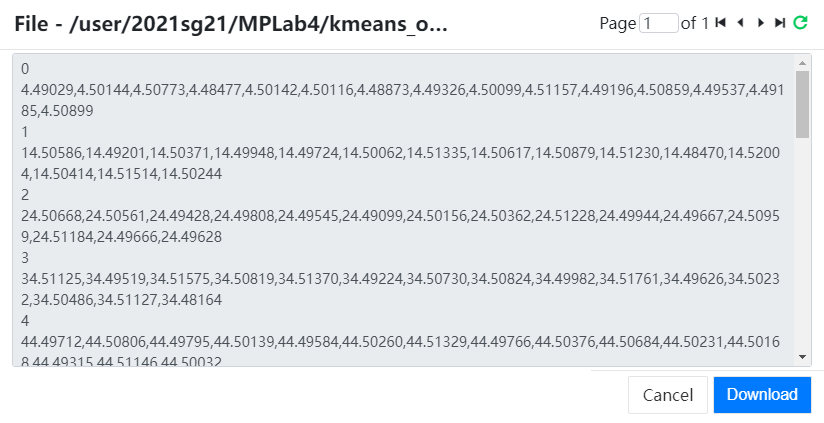
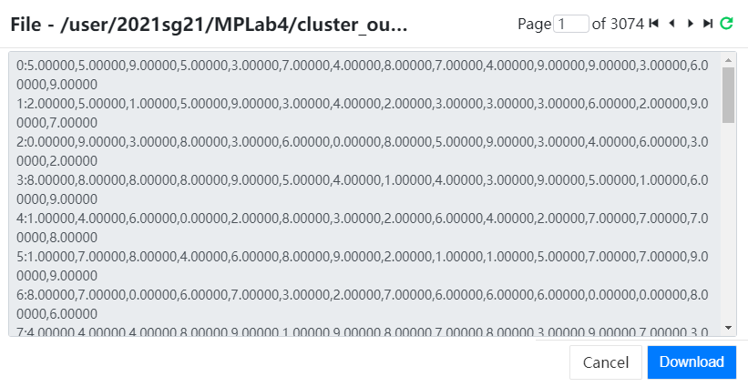
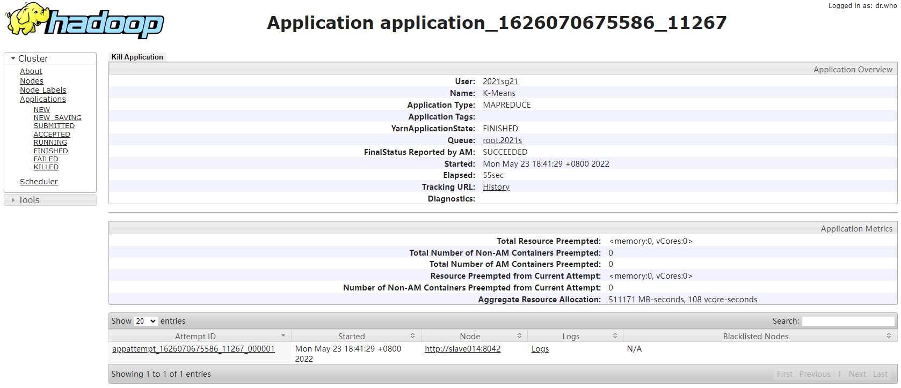
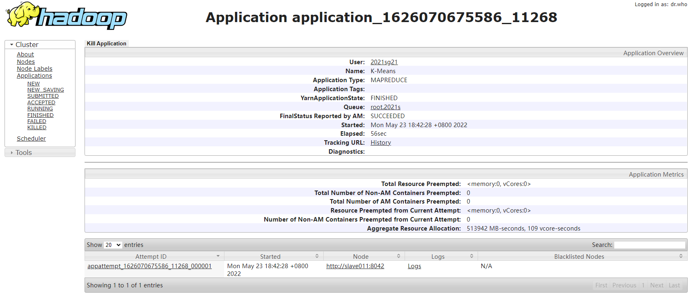
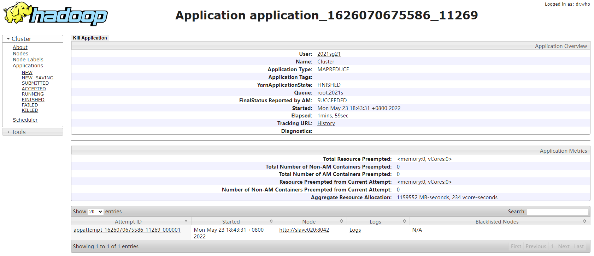

# MPLab4 K-Means聚类算法

黄铭昊 林哲浩 张侃

## 基本概述

### 小组分工

* 黄铭昊：负责框架构建、测试；
* 林哲昊：负责选做；
* 张侃：负责基本功能。

### 项目管理

采用Github进行项目管理。

Github仓库：https://github.com/KitasanMPLab/MPLab4

## 框架

### VectorDoubleWritable

为了存储向量，需要定义一个数据类型`VectorDoubleWritable`：

```java
public class VectorDoubleWritable extends Vector<DoubleWritable> implements Writable, Comparable<VectorDoubleWritable>
```

* 支持向量加法、乘法、除法、求距离操作；

* 同时还支持用`Text`或`String`类型初始化操作，格式形如`xxx,xxx,xxx,...,xxx`；

* 还支持`Writable`和`Comparable`的接口操作，比较精度为`1e-6`，以及转化成字符串的操作。

### PairVectorDoubleInt

为了方便后续Map和Reduce的设计，需要设计一个键值对类型`<VectorDoubleInt, IntWritable>`：

```java
public class PairVectorDoubleInt extends PairWritable<VectorDoubleWritable, IntWritable>
```

其中`PairWritable`实现方式和实验2的`PairWritableComparable`类似。

### CenterFileOperation

`CenterFileOperation`用于支持聚类中心文件的读写操作：

* 将聚类中心存储到文件中；
* 从文件中读取聚类中心；
* 从文件夹中读取聚类中心。

### Job迭代

输入为`<center-in>`和`<point-in>`，输出为`<k-means-out>`和`<cluster-out>`。

设立一个临时**文件**，用于存储上一次聚类中心结果，存放在`<k-means-out>/temp`中。

每次聚类中心的结果存放在`<k-means-out>/final`**文件夹**中。

具体的核心代码如下：

```java
//将initial_centers存放到<k-means-out>/temp中
initKMeansOut(conf, centerIn, kMeansOut, tempKMeansOut);
do {
    //清理上一次聚类中心结果
    clearKMeansOut(conf, finalKMeansOut);
    //运行kMeansJob
    Job kMeansJob = getKMeansJob(conf, tempKMeansOut, pointIn, finalKMeansOut);
    boolean flag = kMeansJob.waitForCompletion(true);
    if (!flag) System.exit(1);
    //比较这次聚类中心和上一次聚类中心结果，并将这次结果覆盖到<k-means-out>/temp中，如果收敛则结束循环
} while(!check(conf, tempKMeansOut, finalKMeansOut));
//运行clusterJob
Job clusterJob = getClusterJob(conf, tempKMeansOut, pointIn, clusterOut);
System.exit(clusterJob.waitForCompletion(true) ? 0 : 1);
```

## 基本功能

### Map

输入：`<p, vector_p>`

输出：`<cluster_ID, <vetcor_p, 1>>`

执行`map`之前，通过分布式缓存传递`cluster`信息，在`setup`函数里读取各个`cluster`点的信息并储存，便于共享和使用。

在`map`函数里，通过输入的内容来获取输入点的坐标，并通过计算其与各个`cluster`的距离，找出最短距离点，发送`<cluster_ID, <vetcor_p, 1>>`

```Java
setup() {
    all clusters -> centers
}
```

```Java
map(p, vetcor_p) {
    minDis = Double.MAXVALUE
    cluster_ID = -1
    for i=0 to centers.length {
        dis = getDistance(p, centers[i])
        if dis < minDis {
            minDis = dis
            cluster_ID = centers[i].ID
            //遍历centers，找出距离p最短的cluster点
        }
    }
    emit(cluster_ID, <vector_p, 1>)
}
```

### Combine

输入：`<cluster_ID, [<vetcor_p, n>]>`

输出：`<cluster_ID, <vetcor_p, n>>`

将中间数据进行合并处理，以减少`reduce`计算量以及信息传输量。
`combine`不能改变输入输出键值对的类型，本质上是在`reduce`之前将大量的数据先进行一次合并，方便传输和后续运算。

```
reduce(cluster_ID, [<vetcor_p, n>]) {
    vetcor_p = 0.0
    n = 0
    for item in [<vetcor_p, n>] {
        vetcor_p += item.vector_p * item.n
        n += item.n
    }
    vetcor_p /= n
    emit(cluster_ID, <vetcor_p, n>)
}
```

### Reduce

输入：`<cluster_ID, [<vetcor_p, n>]>`

输出：`<cluster_ID, vetcor_p>`

`reduce`和`combine`一样，都是合并并计算各个向量的均值，基本相同，区别仅在于`combine`用于中间处理，而`reduce`用于输出结果，因此`emit`有所不同。

```
reduce(cluster_ID, [<vetcor_p, n>]) {
    vetcor_p = 0.0
    n = 0
    for iteem in [<vetcor_p, n>] {
        vetcor_p += item.vector_p * item.n
        n += item.n
    }
    vetcor_p /= n
    emit(cluster_ID, vector_p)
}
```

## 选做

上一阶段完成后，已经形成了最终的聚类中心，再迭代也不会改变。因此，要将原数据集中不同簇的数据划分到不同文件，只要继续以原数据集为输入，在 Mapper 中按照原方法对数据集再进行一次聚类，然后在 Reducer 中把每个 key 即聚类中心 ID 对应的所有 values 写到该聚类中心对应的输出文件中即可。聚类中心文件依然使用 `DistributedCache` 传递给 Mapper；Hadoop 的 `MultipleOutputs` 类提供了将数据写入到指定的多个输出文件的能力。

### Map

输入：`[<v, pid>]`，输出：`[<clusterID, <v, pid>>]`

与基本任务的 Map 阶段类似。不同的是，输出的 value 的第二个分量不表示数据点个数，而是该数据点的编号：

```rust
map(key, p) { // p 是一条数据
    let (v, pid) = p; // 向量 v 是数据 p 的内容，pid 是数据 p 的编号
    minDis = Double.MAX_VALUE;
    index = -1;
    for i=0 to centers.length {
        dis = computeDist(v, centers[i]);
        if dis < minDis {
            minDis = dis;
            index = i;
        }
    }
    emit(index, (v, pid)); // 输出 pid 而不是 1
}
```

### Reduce

输入：`[<clusterID, [<v, pid>]>]`，输出：`[<pid, v>]`（在每个 `clusterID` 对应的文件中）

只要根据输入的聚类 ID 获取输出文件名，将每个数据条目的 ID 和向量内容输出到该文件中即可：

```rust
reduce(clusterID, values) {
    f = getFileName(clusterID);
    for each (v, pid) in values {
        emitToFile(f, (pid, v));
    }
}
```

为了将输出写到指定的输出文件中，需要使用 `MultipleOutputs` 类。在创建 job 时，读取聚类中心文件，对每个聚类中心创建一个 named output，并将文件名通过 `Configuration` 传给 Reducer。注意必须在 `Reducer` 类的 `setup` 和 `cleanup` 两个方法中创建和**关闭** `MultipleOutputs` 对象，否则程序终止时输出可能还没有全部写入到磁盘上，造成结果不完整：

```java
@Override
public void setup(Context context) {
    mos = new MultipleOutputs<>(context);
}

@Override
public void cleanup(Context _context) throws IOException, InterruptedException {
    mos.close();
}
```

## 实验结果

在实验平台运行命令：

` hadoop jar MPLab4/MPLab4.jar /data/2022s/kmeans/initial_centers /data/2022s/kmeans/dataset.data MPLab4/kmeans_out MPLab4/cluster_out`

### 基本功能

共迭代3轮。

结果在`MPLab4/kmeans_out/final`中。



### 选做

结果在`MPLab4/cluster_out`中。

以`cluster0-r-00000`为例。



### WebUI执行报告

#### 基本功能

* 第一轮迭代。

  

* 第二轮迭代。

  

* 第三轮迭代。

  

#### 选做


